# Investigating the Offensive Explosion in the NBA from 2001-2018

I decided to do a statistical investigation of the NBA from 2001-2018 because I have always had a pashion for basketball, and thought it would be a good first project beacause of all the statistics available online. 

## Goals of the Study

Over the last two decades the NBA has experienced somewhat of a revolution in the way the game is played. I wanted to use various statistical methods to provied evidence either proving or disproving whether or not this was true. 

My hypothesis going into the study was that offensive metrics for the current era of the NBA has increased compared to the beginning of the century. 

## Methods and Pipeline
The source for all my data was https://www.basketball-reference.com/leagues/ 

### Webscraper
I built a webscraper that scraped the "Team Stats", "Miscellaneous Stats", and "Team Shooting" tables for each season from 2001-2018 (the year being when the finals took place). My scraper stored each table as a BeautifulSoup object in one dictionary that I piped into a Mongo database for storage. 

### Pandas Dataframes
My next step was reading the BeautifulSoup objects into Pandas dataframes. I selected certain statistics that I was interested in investigating, and then I created a dataframe for every season. 
Below is an example of one of the DataFrames for the 2018 season.

### Analysis
To perform my analysis I used two sample ttests from the numpy and scipy libraries. I also used Matplotlib for data visualization 

## Results
#### 2018 Season
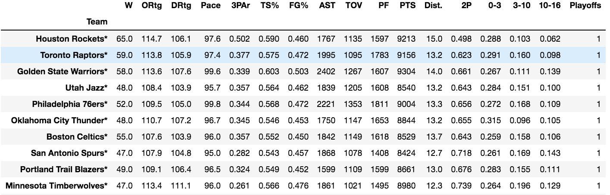

I also created a Dataframe with the league averages for all the statistics for each year, so that I could plot the stats over time to get a visual of the trends in each statistic. 

#### League Averages 
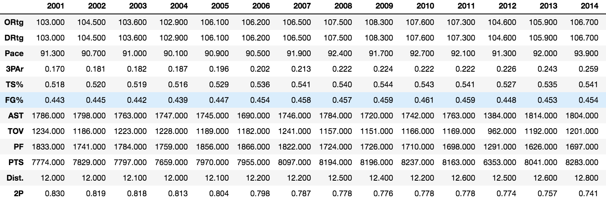

### Exploratory Plots
Using the league averages table I created plots for total points scored,total assists, average pace, total count of turnovers, average FG%, average TS%, average FGA distance, percent of FGA from 3, and the average offensive rating for the entire league over each season. 

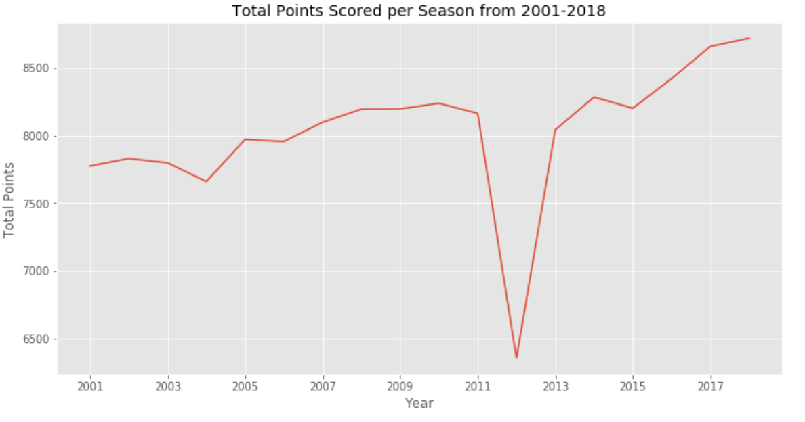

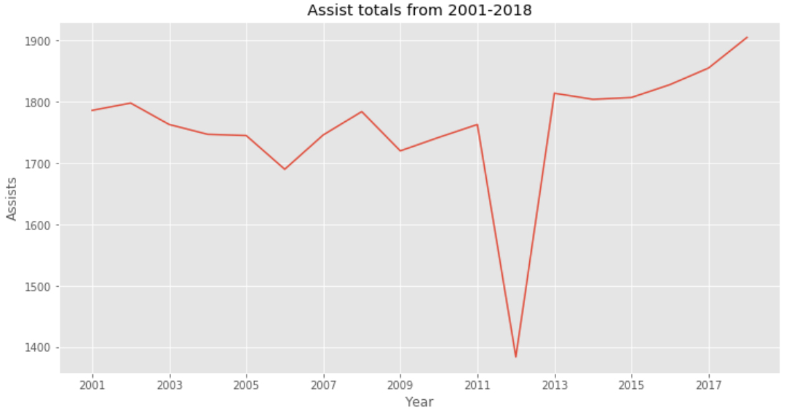

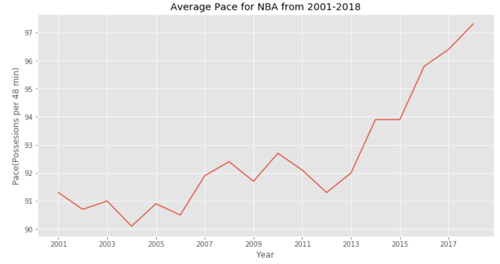

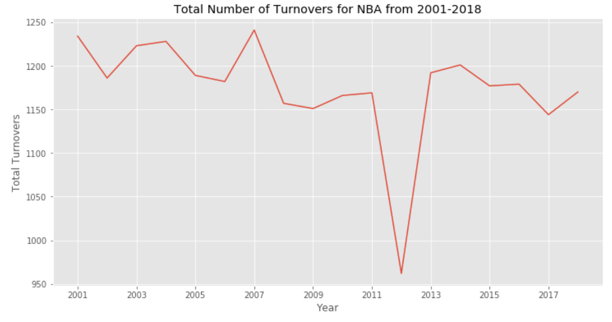

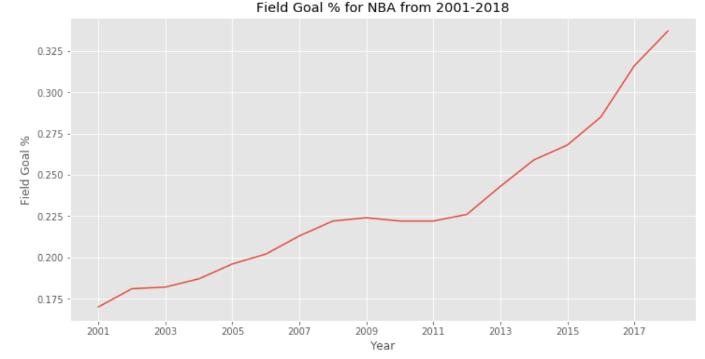

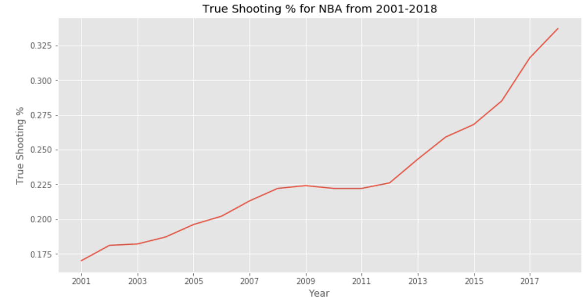

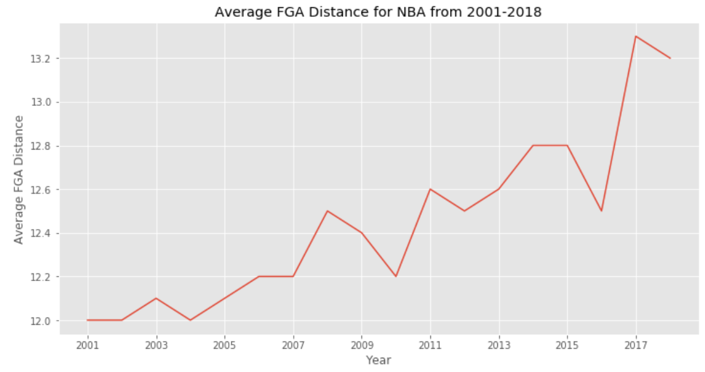

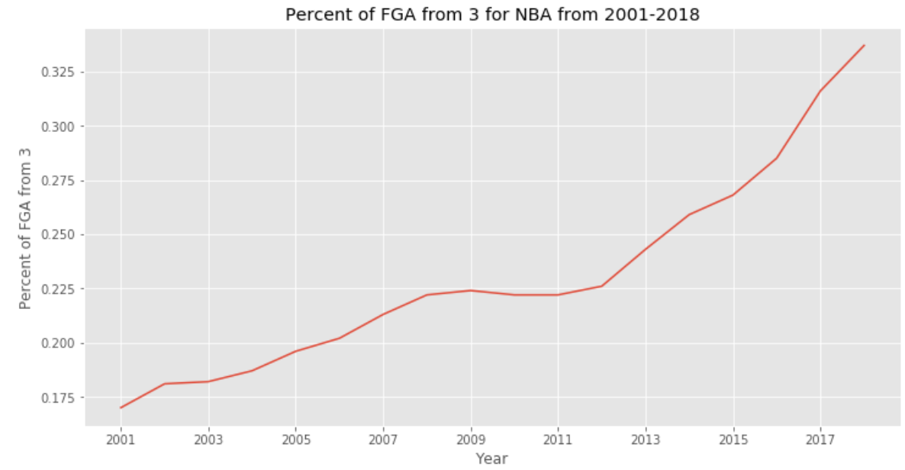

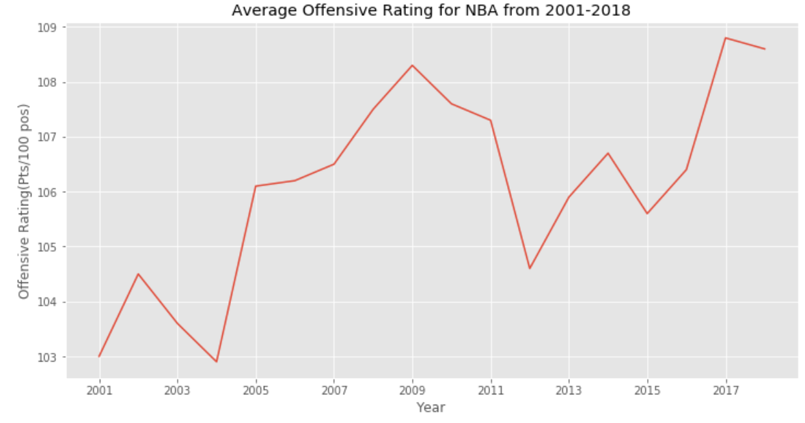

Based on the plots above, there seems to be an increase in the offensive production in the modern era of the NBA compared to the beginning of the century. To confirm this I perfomed some statistical analysis on selected statistics. 

### Statistical Testing

## Bias and Error
There are many potential sources of Bias and error in my study. Here are just a few of those sources:
-Interaction between statistics
-Injuries to key players that could cause a decrease in offensive production
-In 2012 there was a lockout. In this season there were fewer games, which impacted the total amounts for that year. This also could have had an impact on the conditioning of the players, and they had to play their way into shape at the beginning of the season. This could have caused a decrease in offensive production.
-Independent and random sampling. There might be unintentional bias included in the selection process for my 'random' sampling. Instead of looking at the averages for a single year I could have taken a sample from different teams for a span of years. 

## Future Work for Project
The next step in this project includes organizing and cleaning up the coding portion of my project. Right now it would be very difficult for someone else to reproduce this study because most of the coding was done using Jupyter Notebook. I need to create more pythonic functions that would make the study easier to reexecute or add data to. As of now I only have two functions that are in .py files. 

After cleaning up the coding aspect of the project, I would scrape more data from Basketball Reference to look into the changes in statistics over a much larger peroiod of time. I could go as far back as the early 1970's to see how much the NBA has changed over its existence.

Use pergame stats instead of season totals in order to account for lockout seasons. 

Due to time constraintes I was unable to perform all of the statistical tests I wanted to do. I also was unable to plot the various distributions of the samples I took. 

Lastly I would pull more safisticated data from sources like Second Spectrum and use their statistics to compare the various eras in the NBA.