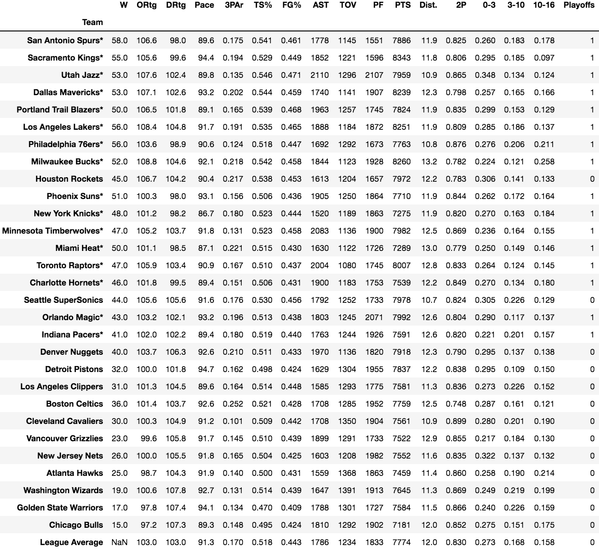

# Investigating the Offensive Explosion in the NBA from 2001-2018

I decided to do a statistical investigation of the NBA from 2001-2018 because I have always had a pashion for basketball, and thought it would be a good first project beacause of all the statistics available online. 

## Goals of the Study

Over the last two decades the NBA has experienced somewhat of a revolution in the way the game is played. I wanted to use various statistical methods to provied evidence either proving or disproving whether or not this was true. 

My hypothesis going into the study was that offensive metrics for the current era of the NBA has increased compared to the beginning of the century. 

## Methods and Pipeline
The source for all my data was https://www.basketball-reference.com/leagues/ 

### Webscraper
I built a webscraper that scraped the "Team Stats", "Miscellaneous Stats", and "Team Shooting" tables for each season from 2001-2018 (the year being when the finals took place). My scraper stored each table as a BeautifulSoup object in one dictionary that I piped into a Mongo database for storage. 

### Pandas Dataframes
My next step was reading the BeautifulSoup objects into Pandas dataframes. I created a dataframe for every season. 

